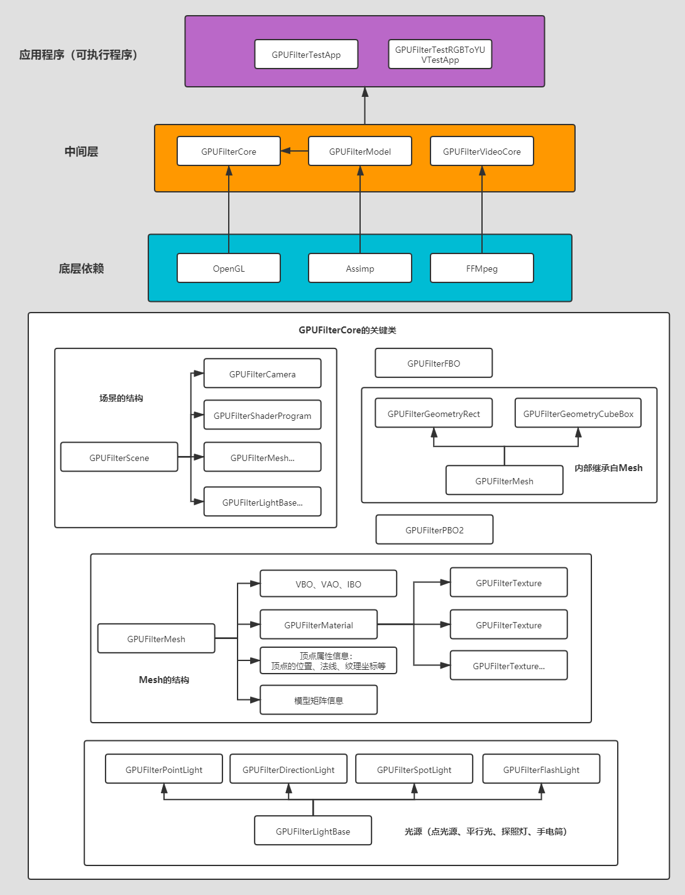
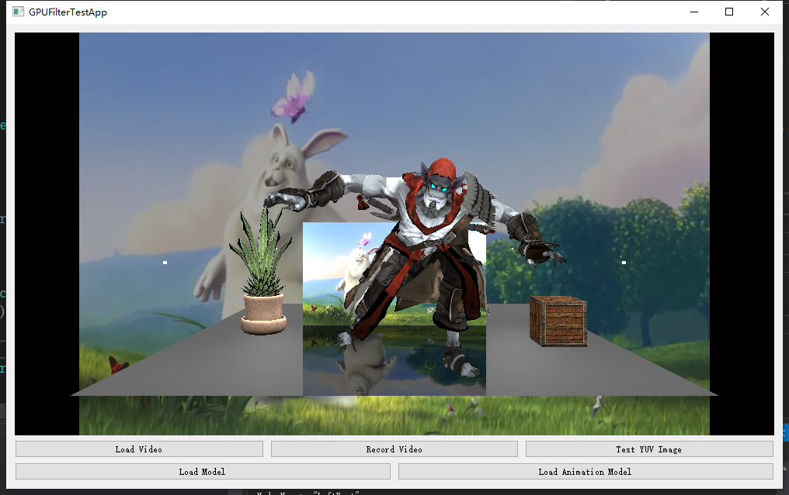
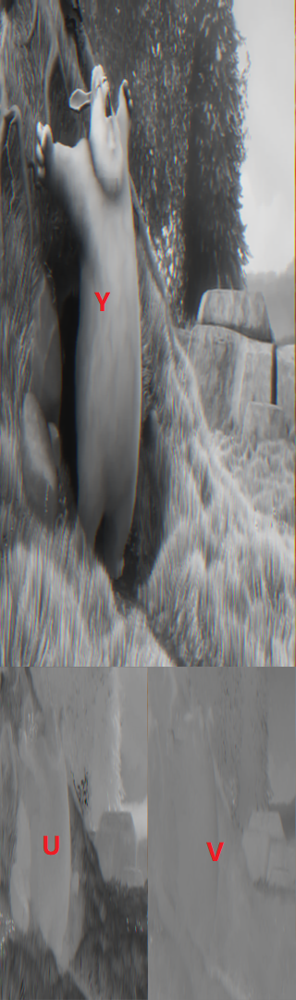

# GPUFilterEngine

GPUFilterEngine是对OpenGL基础和一些3D概念的封装，支持视频YUV和RGB的图像格式转换。
整体软件设计图如下：

该库由三个模块构成：
- **GPUFilterCore:** 核心模块，对OpenGL和一些3D概念进行封装。包括 **网格** 、 **材质** 、 **纹理** 、 **相机** 、 **光照** 、 **FBO** 、 **PBO** 等等。
- **GPUFilterModel:**  模型模块，使用 **Assimp** 库解析模型。支持 **静态模型** 和 **蒙皮骨骼动画** 。
- **GPUFilterVideoCore:** 视频编解码模块。主要使用 **FFMpeg** 库，实现视频的编码和解码。

有两个测试程序
- **GPUFilterTestApp:** 测试程序，具有添加视频并渲染，添加模型和骨骼动画，录制视频等功能。

效果图如下：

- **GPUFilterRGBToYUVTestAPP:** 专门为 **YUV** 和 **RGB** 相互转换编写的测试程序。

# GPUFilterCore的结构说明

下面是对GPUFilterCore中主要的类，做一些说明：

- **GPUFilterTexture：** 纹理，支持RGB、RGBA和LUMINANCE类型的纹理数据。该纹理仅为2D纹理。
- **GPUFilterMaterial：** 材质。支持 **环境光** 、 **漫反射** 、**镜面反射** 的材质颜色及纹理贴图。支持使用扩展纹理，当YUV转换成RGB时，需要对ExtraTexture1、ExtraTexture2、ExtraTexture3设置对应的YUV纹理数据。可以设置该材质是否受光照的影响，及强度系数等参数。
- **GPUFilterMesh：** 网格。网格是一组定点数据的集合。它内部包含 **VBO** 、 **IBO** 、 **VAO** 。可以添加定点属性数据，包括定点的位置信息，颜色信息，法线，纹理坐标等。可以绑定 **材质** ，设置自己的模型矩阵等接口函数。类 **GPUFilterGeometryRect** 和 **GPUFilterGeometryCubeBox** 均继承自 **GPUFilterMesh** ，其中 **GPUFilterGeometryRect** 为一个四边形， **GPUFilterGeometryCubeBox** 为一个立方体。
- **GPUFilterLightBase：** 光照的基类。
- **GPUFilterDirectionLight：** 方向光，继承自 **GPUFilterLightBase** 。
- **GPUFilterPointLight：** 点光源，继承自 **GPUFilterLightBase** 。
- **GPUFilterSpotLight：** 探照灯，继承自 **GPUFilterLightBase** 。
- **GPUFilterFlashLight：** 手电筒，继承自 **GPUFilterLightBase** 。手电筒和探照灯的区别在于，手电筒会跟随着相机的位置和方向变化而变化。
- **GPUFilterCamera：** 相机。该相机为透视相机，可以设置相机的位置，朝向等信息。如果在场景中不想受到相机的影响，可以调用 **setCameraEnabled()** 接口，关闭相机。
- **GPUFilterScene：** 场景。可以在场景中添加网格和光照等信息，并实现最终的绘制。该场景中默认有一个透视相机。具有设置背景色和填充模式（ **面填充或者线框模式** )。
- **GPUFilterFBO** FrameBufferObject。可以用于离屏渲染。
- **GPUFilterPBO2** 双PBO，这里仅为Pack即可以从FBO中获取图像数据。

# YUV转RGB流程说明

YUV转RGB，目前支持所有YUV格式转为RGB。但是具体的数据内容要自行填写，包括FFMpeg的AVFrame字节对齐问题也是要自己处理的。流程如下

1. 创建OpenGL上下文。
2. 创建场景。
3. 创建Mesh，并为其设置材质（打开扩展纹理）。添加Mesh到场景中。
4. 创建FBO和PBO。
5. 场景初始化，FBO和PBO初始化。
6. 创建并设置纹理数据。也就是YUV的数据。
7. 绑定FBO并渲染。
8. 绑定FBO并从PBO从读取转换后的数据。

具体可以参考文件 **YUVToRGBProcesser.cpp**

# RGB转YUV流程说明

目前RGB转YUV只支持转为YUV420P，流程如下：

1. 创建OpenGL上下文。
2. 创建 **GPUFilterPostProcessScene** 场景（内部包含FBO）。并设置为 **GPUFilterPostProcessScene::t_toYUV** 模式。只要对其设置一个纹理，渲染后即是转换完成。
3. 创建纹理。
4. 创建PBO。
5. 初始化，并设置纹理，绑定FBO并渲染。
6. 绑定FBO并从PBO中读取转换后的数据。

具体可以参考文件 **RGBToYUVProcesser.cpp** ，转换后结果为RGBA的数据，显示效果如下如下：

# GPUFilterModel模块说明

**GPUFilterModel** 支持加载静态模型和骨骼动画。因为模型解析使用Assimp，所以支持多种格式的模型文件。

- **GPUFilterModel：** 模型类，加载模型后会生成一个树形节点关系，每个节点对应一个或多个Mesh。
- **GPUFilterBoneMesh：** 骨骼Mesh。为定点添加骨骼ID和Weight。
- **GPUFilterBone：** 骨骼类，可以对关键帧进行插值。
- **GPUFilterAnimation：** 动画类。 加载动画，生成关键帧、变换矩阵等信息。
- **GPUFilterAnimator：** 获取最终的变换矩阵信息。

# GPUFilterVideoCore模块说明

- **GPUFilterVideoDecodec：** 实现视频解码
- **GPUFilterVideoEncodec：** 实现视频编码
